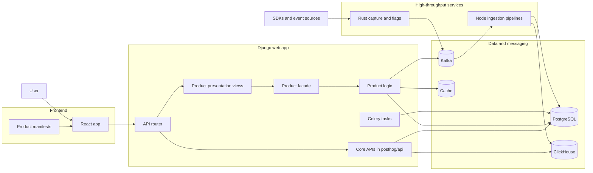

# PostHog architecture overview

This is the shortest accurate mental model I would use to navigate PostHog as a new contributor.

## How to read the diagram

1. `frontend/` is the web app, and product `manifest.tsx` files plug routes and product navigation into it.
2. `posthog/api/__init__.py` is the main route registration hub for both core APIs and product-backed endpoints.
3. `posthog/` still contains a lot of core logic, models, ClickHouse work, and Celery tasks.
4. `products/` holds the newer vertical slices.
   In the modern shape, request handling enters through `presentation/views.py`,
   crosses the public boundary in `facade/`,
   and reaches business logic in `logic.py`.
5. High-volume event ingestion is not just Django.
   Rust and Node services participate in capture, Kafka transport, and downstream processing.

## Real files behind each box

| Diagram box | Files to read |
| --- | --- |
| Product manifests | `products/*/manifest.tsx` |
| React app | `frontend/src/` |
| API router | `posthog/api/__init__.py` |
| Core APIs | `posthog/api/` |
| Product presentation views | `products/*/backend/presentation/views.py` |
| Product facade | `products/*/backend/facade/api.py` |
| Product logic | `products/*/backend/logic.py` |
| Celery tasks | `posthog/tasks/` and `products/*/backend/tasks/` |
| Rust capture and flags | `rust/` |
| Node ingestion pipelines | `nodejs/src/ingestion/` |
| PostgreSQL | `posthog/models/` and product models |
| ClickHouse | `posthog/clickhouse/` |
| Kafka | search for `KafkaProducer`, `KAFKA_`, and ingestion consumers |
| Cache | product cache helpers like `products/notifications/backend/cache.py` |

## What matters most for onboarding

- Treat `posthog/` as the legacy core.
- Treat `products/` as the preferred home for newer product work.
- Expect both styles to coexist.
- Learn route wiring and app registration early:
  `posthog/api/__init__.py` and `posthog/settings/web.py`.
- When a product already has `presentation/`, `facade/`, and `logic.py`,
  follow that structure instead of inventing a new path.

Validation: runtime-validated
