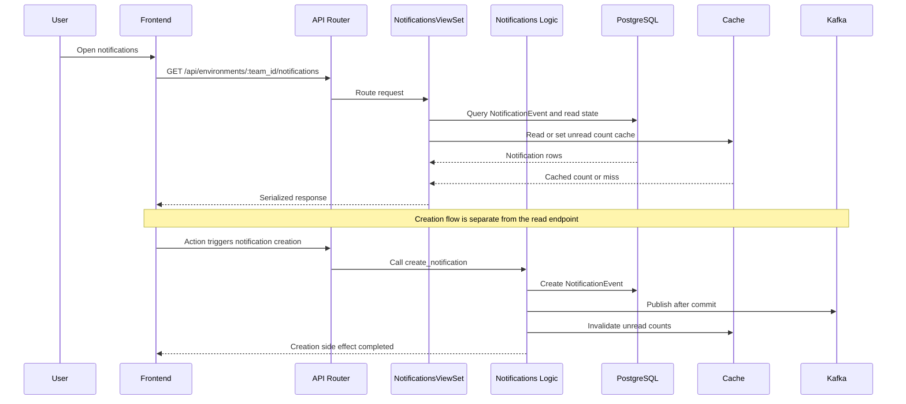
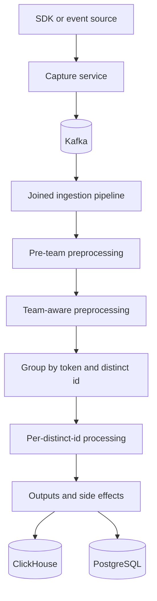

# PostHog data flows

These are the two flows I would learn first as a contributor:

1. a product-facing HTTP flow
2. the ingestion pipeline flow

## 1. Product request flow: Notifications

This is a modern-enough example because it shows a clean split between
presentation, contract/facade, logic, model persistence, cache, and Kafka side effects.

### Files to trace

- Route registration:
  `posthog/api/__init__.py`
- Read path:
  `products/notifications/backend/presentation/views.py`
- Response shape:
  `products/notifications/backend/presentation/serializers.py`
- Write path:
  `products/notifications/backend/logic.py`
- Persistence:
  `products/notifications/backend/models.py`
- Cache:
  `products/notifications/backend/cache.py`
- Public contract:
  `products/notifications/backend/facade/contracts.py`

### What to notice

- The read path is presentation-led and query-oriented.
- The write path is logic-led and side-effect-oriented.
- Cache invalidation and Kafka publish happen explicitly after commit.
- This product is a good reference for the newer architecture style.

## 2. Event ingestion flow

This is the best early map for understanding how high-volume event data moves through PostHog.

### Files to trace

- Plain-English structure:
  `docs/published/handbook/engineering/project-structure.md`
- Main example pipeline:
  `nodejs/src/ingestion/analytics/joined-ingestion-pipeline.ts`

### What to notice

- preprocessing is staged, not monolithic
- team context is attached before team-specific logic runs
- grouping by `token:distinct_id` preserves useful ordering guarantees
- concurrency is deliberate:
  groups can run concurrently,
  but events within a single group stay sequential
- result handling and side effects are explicit terminal steps

## How to use these flows in real issue work

When you open an issue, try to classify it first:

| If the issue smells like... | Start by tracing... |
| --- | --- |
| API response bug | router -> viewset -> serializer -> query/model |
| product behavior bug | view/presentation -> facade -> logic -> model |
| async side effect bug | logic -> transaction boundary -> Kafka/task/cache |
| analytics/event issue | capture -> Kafka -> joined ingestion pipeline -> outputs |

Validation: runtime-validated
